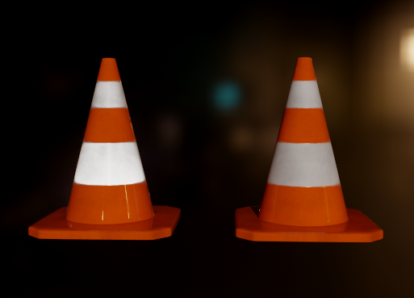

<!--
Copyright 2026 NVIDIA Corporation. All rights reserved.
-->

# EXT_materials_retroreflection

## Contributors

* Martin-Karl Lefrancois, NVIDIA, mlefrancois@nvidia.com
* Based on Portsmouth, Raab, Belcour, Liu — "The Minimal Retroreflective Microfacet Model", JCGT 15(1), 2026

## Status

Draft

## Dependencies

Written against the glTF 2.0 specification.

## Interaction with other extensions

This extension is compatible with `KHR_materials_specular`, `KHR_materials_ior`, and
`KHR_materials_anisotropy`, but does not require them. The retroreflective lobe targets
the microfacet specular and metal lobes; diffuse and sheen lobes are unaffected.

## Overview

This extension adds a physically-plausible retroreflective response to any glTF material that
uses a microfacet BSDF (GGX). It implements the *Minimal Retroreflective Microfacet (MRM)*
model of Portsmouth et al. (JCGT 15(1), 2026): the only required modification of a standard
microfacet BSDF is to substitute the outgoing view direction `V` with its reflection about
the surface normal, `V_retro = 2 * dot(V, N) * N - V`, before evaluation and sampling.
This redirects the GGX specular peak into the back-scatter direction, producing the bright
retroreflective highlight seen on safety tape, traffic cones, high-visibility clothing,
glass-bead road markings, and corner-reflector arrays. MRM preserves reciprocity and
energy conservation under reflection-symmetric NDFs (including GGX, Beckmann, and Phong).

A `retroreflectionFactor` linearly blends between the regular forward microfacet (`0`) and
the retroreflective microfacet (`1`), matching the OpenPBR `geometry_retroreflection`
control. The base material roughness controls how closely the camera and light must align
to show the retroreflective highlight.

A renderer that does not implement this extension MUST render the material's base PBR
representation. The extension is therefore never required.

<figure>

<figcaption><em>Left: <code>EXT_materials_retroreflection</code> on both white bands (<code>retroreflectionFactor</code> = 1, masked by <code>retroreflectionTexture</code>). The lower band appears brighter because the light and camera are more closely aligned there — retroreflection is view-dependent. Right: same material without the extension. Rendered in <a href="https://github.com/nvpro-samples/vk_gltf_renderer">vk_gltf_renderer</a> using the <a href="samples/traffic_cone/traffic_cone.gltf">traffic_cone</a> sample.</em></figcaption>
</figure>

## Extending Materials

Adding `EXT_materials_retroreflection` to a material's `extensions`:

```json
{
  "materials": [
    {
      "name": "TrafficConeBaseMat",
      "pbrMetallicRoughness": {
        "baseColorTexture": { "index": 0 },
        "metallicFactor": 0.0,
        "roughnessFactor": 0.35
      },
      "extensions": {
        "EXT_materials_retroreflection": {
          "retroreflectionFactor": 1.0,
          "retroreflectionTexture": { "index": 2 }
        }
      }
    }
  ],
  "extensionsUsed": [ "EXT_materials_retroreflection" ]
}
```

| | Type | Description | Required |
| -------------------------- | -------- | ----------- | ------------------ |
| **retroreflectionFactor** | `number` | Linear blend between forward microfacet (0.0) and retroreflective microfacet (1.0). Range [0, 1]. | No, default: `0.0` |
| **retroreflectionTexture** | [`textureInfo`](https://registry.khronos.org/glTF/specs/2.0/glTF-2.0.html#reference-textureinfo) | Per-texel multiplier for `retroreflectionFactor`, sampled from the **R** channel. Values outside [0,1] are clamped. | No |

The final per-shading-point retroreflection weight is:

```
w = retroreflectionFactor * (retroreflectionTexture.r if present else 1)
```

## Implementation

*This section is non-normative.*

For the full material BSDF `f(V, L, mat)`, let `V` be the outgoing view direction
(surface → camera) and `L` the direction toward the light. The retroreflective response
applies the Minimal Retroreflective Microfacet (MRM) substitution from Portsmouth et al. 2026:

```
V_retro = reflect(-V, N)

f_retro(V, L, mat) = f(V_retro, L, mat)
f_blended(V, L, mat) = lerp(f(V, L, mat), f_retro(V, L, mat), w)
```

where `w` is the per-shading-point weight from the Properties section and `f` is the
material's existing BRDF/BSDF evaluation (for example, as defined in
[Appendix B](https://www.khronos.org/registry/glTF/specs/2.0/glTF-2.0.html#appendix-b-brdf-implementation)
of the glTF 2.0 specification).

Implementations of `f` can vary based on device performance and resource constraints. The
same `V → V_retro` substitution is used when sampling the retroreflective lobe and when
evaluating its PDF; see Listing 1 of Portsmouth et al. 2026.

### BTDF policy

Per Sec. 5 of Portsmouth et al. 2026 ("Combination of BRDF and BTDF"), authors observed that
using the regular (non-MRM) BTDF `f_t` instead of `f_{t,MRM}` produces more intuitive results,
particularly when the index of refraction is close to 1. This extension follows the same
recommendation: **authors should not enable `retroreflectionFactor` on materials that also
carry `KHR_materials_transmission` with IOR ≈ 1**. The renderer's linear-blend implementation
applies the MRM substitution to all lobes for simplicity, so the renderer cannot enforce
this policy — it is up to the asset author to keep retroreflection assigned to opaque or
near-opaque materials. Mixed glass + retroreflective surfaces are out of scope.

## Schema

* [material.EXT_materials_retroreflection.schema.json](schema/material.EXT_materials_retroreflection.schema.json)

## Sample Assets

* [traffic_cone](samples/traffic_cone/traffic_cone.gltf) — traffic cone with `retroreflectionFactor` and `retroreflectionTexture`, shown alongside a non-retroreflective material for comparison. Includes `KHR_lights_punctual` for directional lighting. Model by [hinndia](https://sketchfab.com/hinndia), [CC-BY-4.0](http://creativecommons.org/licenses/by/4.0/); see [license.txt](samples/traffic_cone/license.txt).

## Known Implementations

* [NVIDIA vk_gltf_renderer](https://github.com/nvpro-samples/vk_gltf_renderer)

## Resources

* Portsmouth, J.; Raab, M.; Belcour, L.; Liu, F. *The Minimal Retroreflective Microfacet
  Model.* Journal of Computer Graphics Techniques, 15(1):60–75, 2026.
  <http://jcgt.org/published/0015/01/04/>
